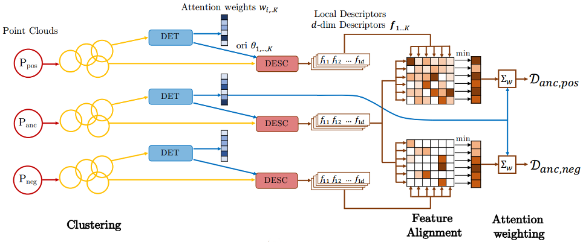

# 3DFeat-Net: Weakly Supervised Local 3D Features for Point Cloud Registration: TensorFlow 2 Implementation



## About

This work is based on our ECCV2018 paper. 3DFeat-Net is an approach for learning features for point cloud geometric registration under weak-supervision, where the supervision is given in terms of whether 2 point clouds have very high overlap or low (or no) overlap. For details, please read our paper which can be found on [arXiv](https://arxiv.org/abs/1807.09413).

This is a fork of 3DFeatNet, converted to run in TensorFlow 2.x, with instructions on how to convert the resultant SavedModel into a TensorRT engine via an ONNX intermediate.

Bibtex:

```
@inproceedings{yew2018-3dfeatnet,
    title={3DFeat-Net: Weakly Supervised Local 3D Features for Point Cloud Registration},
    author={Yew, Zi Jian and Lee, Gim Hee},
    booktitle={ECCV},
    year={2018}
}
```

## Environment

This version of the code is developed and tested in the following environment:

* Python **3.7.11**
* Tensorflow **2.5**
* CUDA **11.4**
* TensorRT **8.0**

We also use MATLAB scripts for evaluation and processing of data.

## Setup

To begin, create a new `conda` environment in **Python 3.7**, and install the `requirements_tf2.txt` using **pip**. Attempting to install via `conda` will not work, for some reason.

## Network

The network model is in `models/feat3dnet.py`.

### Prerequisites

Before using the model, you first need to compile the customized tf_ops in the folder `tf_ops` (we use the customized grouping and sampling ops from [PointNet++](https://github.com/charlesq34/pointnet2)).

`cd` to `tf_ops` and run `bash tf_ops_compile.sh`. If `nvcc` is not added to path, so do first. If errors are thrown, or the displayed `CUDA` version is wrong, look into the `tf_ops_compile.sh` file and set the `NVCC_VER` variable to the correct version on your machine.

### Training

#### Preparation of data

1. Follow instructions [here](scripts_data_processing/Readme.md#training-data) to download and prepare the training data
2. Also download the test data for descriptor matching (i.e. the 30,000 cluster pairs) by following the instructions [here](scripts_data_processing/Readme.md#test-data). We monitor the false alarm rate at 95% recall, as the training loss is not very informative (The provided script evaluates on all of the test data which can be slow; you can change this behavior by modifying VAL_PROPORTION in train.py)
3. Both the training and test sets should be placed in the same folder. The provided scripts assume they're placed in `../data/oxford`, which should contain two subfolders: `clusters` and `train`.

#### Training

Training is divided into 2 stages, where the first stage only trains the descriptor subnetwork without rotation and attention. For convenience, we provide a training script which runs both parts. Simply execute`./train.sh` (you can configure the top few lines to select the GPU, etc).

Training takes around 1-1.5 days to saturate. During training, progress can be monitored by running `tensorboard --logdir=./ckpt` from the root folder, and the false alarm rate will be shown in the fp_rate graph.

### Inference on Example data in Python

1. Run `inference_example.sh` which will load the pretrained model in the folder `ckpt` and generate the keypoints and descriptors for the example data in `example_data`. A sample checkpoint can be downloaded from [here](https://drive.google.com/open?id=1JYZvFmMO3hgLN4ao3MqcMVgHYZtHhPOv). The output will be stored in `example_data/results`.
2. Run the MATLAB script `scripts/computeAndVisualizeMatches.m` which will match the features, estimate the relative transformation (with RANSAC) between the point clouds and display the results.

It should be straightforward to run on your own data, just make sure the data is in the expected format (see `scripts_data_processing/Readme.md`). Note however the following:

* z-axis should be pointing vertically upwards
* The network considers up to 64 points per cluster. For dense point clouds, it will pick the points randomly (as long the flag `--randomize_points` is set which will randomize the input point ordering). This means that the performance may differ slightly with each run.

## Datasets
Refer to [scripts_data_processing/Readme.md](scripts_data_processing/Readme.md).

## Conversion to ONNX
To convert the trained model for inference into ONNX format, first wait for training to complete. Subsequently, run the `inference_example.sh` script, which will call sample data on the model so that a `SavedModel` can be built. Subsequently, it will save the TensorFlow `SavedModel` to a directory (by defaut, `./ckpt/infer_model`).

Running `inference_example.sh` in the previous step automatically converts and saves the converted ONNX model to the `onnx_models` folder.

If you wish to convert the SavedModels in isolation, call the `tf2onnx.convert` submodule (should be installed as part of `requirements.txt`):
```bash
python -m tf2onnx.convert \
--saved-model /path/to/saved/model --output /path/to/output/onnx \
--load_op_libraries ./tf_ops/grouping/tf_grouping_so.so,./tf_ops/sampling/tf_sampling_so.so \
--rename-inputs in_keypoints,in_pointcloud 
--rename-outputs out_keypoints,out_features,out_attention \
--custom-ops QueryBallPoint,GroupPoint \
--opset 13 --target tensorrt
```
This will save an `onnx` in the specified directory. The model can then be verified visually calling `netron /model/savepath.onnx`.

## Setting up the TensorRT development environment
TensorRT comes with a prebuilt Docker container with TensorRT 8.x in Ubuntu 18.04 with CUDA 11.3. We modified the Dockerfile to include the resources we have been using.

To setup the Docker container, first install Docker. Clone the [TensorRT](https://github.com/NVIDIA/TensorRT) and [onnx-tensorrt](https://github.com/onnx/onnx-tensorrt) repos to a convenient location. We suggest the same parent directory as the one 3DFeatNet is in, and the sample build script below works if it is.
```bash
CUDA_VER=11.3.1
ARG_IMAGENAME="tensorrt-ubuntu18.04-cuda${CUDA_VER}_3dfn"  # change this to your liking
FN3D_LOC="$(pwd)"

sudo docker build -f "${FN3D_LOC}/docker/ubuntu-18.04_modded.Dockerfile" \
--build-arg CUDA_VERSION="${CUDA_VER}" --build-arg uid=$(id -u) \
--build-arg gid=$(id -g) --tag=$ARG_IMAGENAME .
```
To run the Docker image, run
```bash
# This ensures that the TensorRT and onnx-trt build folders can be found.
# Ports are bound for HTTP and TensorBoard.
# Also runs as root!
sudo docker run -it -v "${FN3D_LOC}/..":"/workspace" \
-u root -p 80 -p 6006:6008 \
--gpus all ${ARG_IMAGENAME}:latest
```
When inside the Docker image, run
```bash
source /home/trtuser/.bashrc
bash 3DFeatNet/docker/startup.sh
```
This installs the TensorRT and onnx-trt inside the Docker image. You can also edit this script to your liking.

## Converting ONNX to TensorRT
To convert the ONNX files to TensorRT, start up the Docker image as detailed above.

Firstly, the custom ops need to be built for TensorRT. Luckily, the CUDA function definitions can be reused.

In the TensorRT container, navigate to the 3DFeatNet repo. Then, run the following:
```bash
bash ./TensorRT/build_ops.sh
```
This builds the grouping ops `QueryBallPoint` and `GroupPoint`, and puts their `.so` files in `3DFeatNet/TensorRT/grouping/build`. It also includes the definition for the `Sign` ONNX op which would otherwise be undefined in TensorRT in `3DFeatNet/TensorRT/sign/build`.

Navigate to the 3DFeatNet repo in the container workspace and run the following:
```bash
trtexec --onnx=./onnx_models/model_det_desc.onnx \
--plugins=./TensorRT/ops/grouping/build/libPointNetGroupingOps.so \
--plugins=./TensorRT/ops/sign/build/libSignOps.so \
--saveEngine=./TensorRT/model_det_desc.lib
```

If successful, it registers the inference engine in `./TensorRT/` as `model_det_desc.lib`. You can validate the model building by running it with random-valued data:
```bash
trtexec --shapes=in_pointcloud:1x16384x6,in_keypoints:1x16384x3 \
--loadEngine=./TensorRT/model_det_desc.lib \
--plugins=./TensorRT/ops/grouping/build/libPointNetGroupingOps.so \
--plugins=./TensorRT/ops/sign/build/libSignOps.so
```
It should output something like `&&&& PASSED TensorRT.trtexec [TensorRT v8001]...`.

Subsequently, you can move the file to the `CSLM` directory (or wherever you need to use it), and call inference there. The code to run inference using the TensorRT engine is quite convoluted, and not covered here. It is in the `CSLM` directory.

************